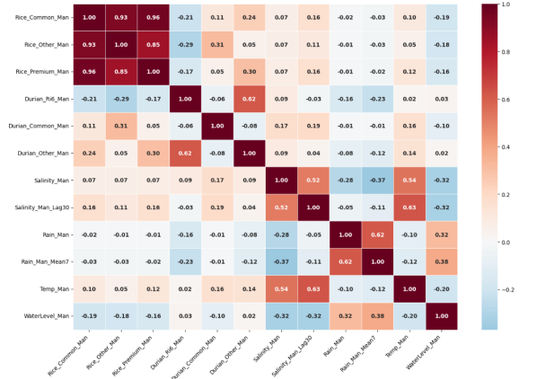
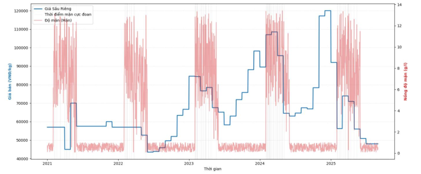
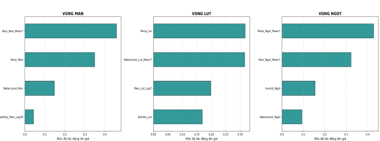

# Weather Impact on Agricultural Prices (2021-2025)

## 1. Project Overview
This seminar project investigates the complex relationship between climate change—specifically extreme weather events like saltwater intrusion and floods—and agricultural prices in the Mekong Delta (ĐBSCL) from 2021 to 2025. By applying Data Science and Machine Learning techniques, the study aims to quantify these impacts and establish a predictive framework to support decision-making for farmers and agricultural enterprises.

**[Read the Full Seminar Report (PDF)](https://drive.google.com/file/d/1WztsW3ohQS0RmvLyb4hYYFb70dCQWRwy/view?usp=drive_link)**

## 2. Technical Highlights
*(Multivariate Correlation Heatmap)*

* **Data Engineering & Preprocessing:**
    * Integrated daily meteorological data from *NASA POWER* with agricultural market price data from the *Ministry of Agriculture and Rural Development*.
    * Implemented *IQR-Capping* for outlier handling to preserve critical extreme weather signals while removing data entry noise.
    * Developed custom *Hydro Logic* algorithms to simulate salinity levels and water depths, which are critical variables for the Mekong Delta.
* **Feature Engineering:**
    * Designed *Lag Features* (Lag 7 and Lag 30 days) to capture the biological delay of crops and market reaction time following environmental shocks.
    * Utilized *Moving Averages (Mean7)* to extract seasonal trends and reduce short-term volatility.
* **Machine Learning Models:*** 
    * Evaluated and compared **Random Forest** and **XGBoost** algorithms.
    * **Random Forest** emerged as the optimal model, achieving an $R^2$ score of up to **0.89** in the Freshwater zone, demonstrating high stability and precision in predicting price fluctuations.

*(Model Performance and Error Distribution)*

## 3. Key Insights
1. **Time-Lag Effect:** Our analysis confirmed that saltwater intrusion has a 30-day delayed impact on Durian prices, whereas rice prices react more immediately to flood-induced logistics disruptions.
* 

2. **Region-Specific Drivers:**
    * **Salinity Cluster (Mặn):** Rainfall (Rain_Man_Mean7) is the most critical driver for Durian prices.
    * **Flood Cluster (Lụt):** Price volatility is primarily driven by temperature and water levels.
    * **Freshwater Cluster (Ngọt):** Temperature is the dominant factor influencing the growth cycle and price of premium rice varieties.
    * *(Feature Importance for Region-Specific Drivers)*

3. **Forecasting Reliability:** With a low Mean Absolute Error (MAE) ranging from 350-650 VNĐ for rice, the model provides a reliable basis for early-warning systems and production planning.

## 4. How to run
1. Clone this repository: `git clone <your-repo-url>`
2. Install requirements: `pip install -r requirements.txt`
3. Open `Seminar.ipynb` in Jupyter Notebook or Google Colab.

## 5. Repository Structure
* `Seminar.ipynb`: The core notebook containing data cleaning, feature engineering, and model training processes.
* `Seminar_Tác_động_thời_tiết_lên_giá_nông_sản_trong_2021-2025.pdf`: The detailed research report.
* `data/`: Processed datasets used for model training.

*Project conducted by: Trần Xuân Trường - Faculty of Mathematics and Computer Science, VNU-HCM University of Science.*

*Feel free to reach out via [truongxuan2834@gmail.com](mailto:truongxuan2834@gmail.com) for any discussion regarding this project.*
